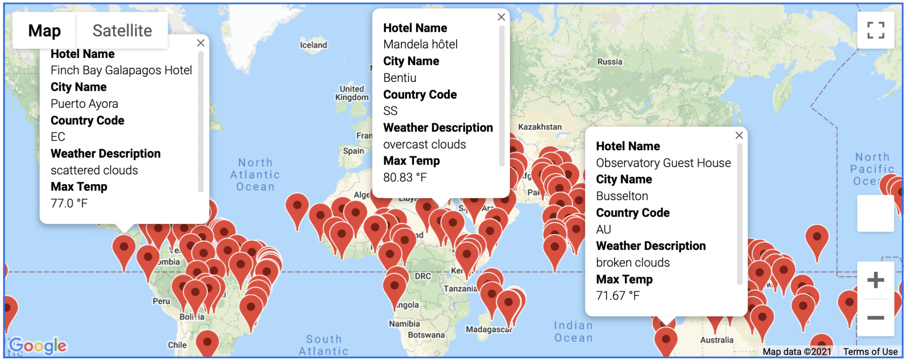
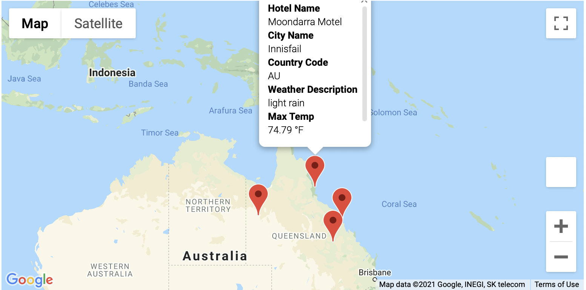
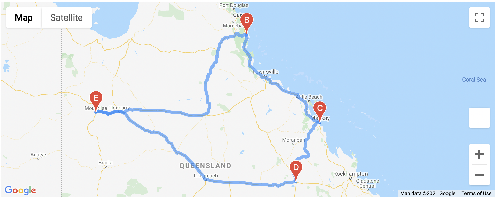

# World_Weather_Analysis

## **Overview**

The purpose of this project is to help Plan My trip, an internet based travel company specializing in hotel and lodging services, to generate preferred Hotel suggestions to their customers, based on search criteria entered by them on the website. Data for over 500 cities around the world is collected and provided to Plan My Trip, from which required information is filtered and presented to the end user, when they enter their preferred travel criteria.

## **Description**
As part of the project the Open Weather Map API has been used to retrieve weather data for multiple randomly generated cities across the world and the same has been exported as a csv file. The same can be seen here [Weather_Database](Weather_Database).  This Weather_Database CSV contains the following information:
- City Name
- Country
- Latitude
- Longitude
- Weather Description
- Maximum Temperature
- Percentage Humidity
- Percentage Cloudiness
- Wind Speed

Then based on temperature preferences entered, a preferred cities dataframe is filtered and generated from the Weather Database, for preferred vacation destinations and using the google Nearby Search API, hotels for the preferred destinations are generated. The same is visualized on a Marker Layer Map, using the Gmaps API, with popup markers for the preferred cities and an info box showing the weather and Hotel information for each city. The [Vacation_Search](Vacation_Search) folder has the map and vacation cities database.

## Vacation Search Map:

Finally, using the Google Directions API, a travel itinerary is created showing the route between four cities chosen from a customer’s possible travel destinations. Then,a marker layer map with a pop-up marker for each city on the itinerary, is created. The [Vacation_Itinerary](Vacation_Itinerary) folder has the geneated files.

## Vacation Itinerary Map:

